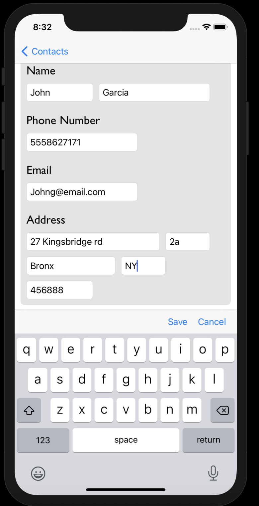
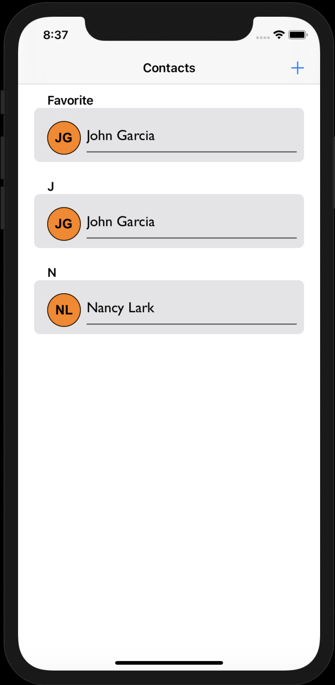
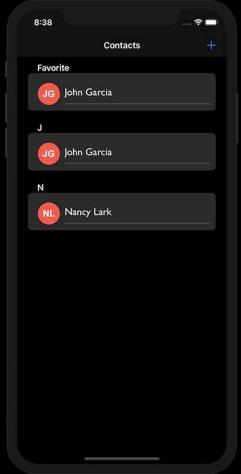

# Contacts-App

## Overview

Contacts-App allows users to create, browse, favorite and edit contacts.

## Features

### Create Contacts

### Contact Details, Edit/Favorite

### Browse Contacts

Normal Mode            | Not Afraid of the Dark...Mode
---------------------- | -----------------------
 | 

## Code Block

### Unit Testing

## Installation

### Prerequisites

### Clone

### Setup

## Built With

## Collaborators

[Juan Ceballos](https://github.com/Juan-Ceballos)

