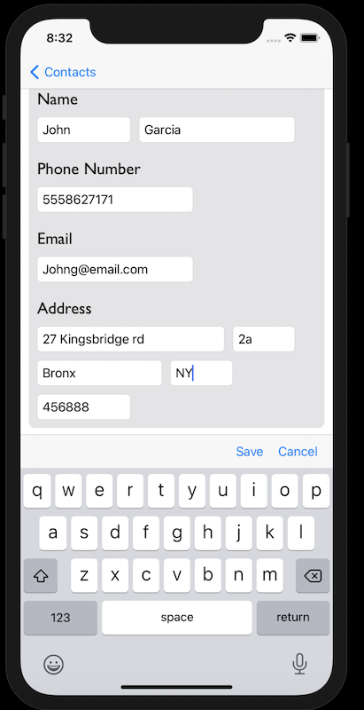
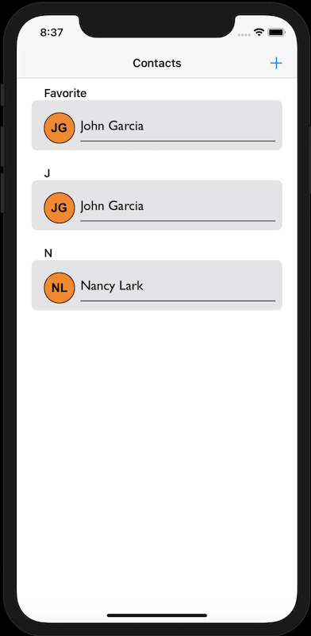

# Contacts-App

## Overview

Contacts-App allows users to create, browse, favorite and edit contacts.


## Features


### Create Contacts



### Contact Details, Edit/Favorite


### Browse Contacts

Normal Mode            | Not Afraid of the Dark...Mode
---------------------- | -----------------------
 | 

## Code Block

### Create Contact Add to Core Data

```swift
public func createFavoriteContact(contact: Contact, isFavorite: Bool, isOriginal: Bool) -> Contact {
    
    let contactFavorite = Contact(entity: Contact.entity(), insertInto: context)
    contactFavorite.firstName = contact.firstName
    contactFavorite.lastName = contact.lastName
    contactFavorite.fullName = "\(contact.firstName ?? "") \(contact.lastName ?? "")"
    contactFavorite.email = contact.email
    contactFavorite.street = contact.street
    contactFavorite.poNumber = contact.poNumber
    contactFavorite.dateCreated = Date()
    contactFavorite.apt = contact.apt
    contactFavorite.city = contact.city
    contactFavorite.state = contact.state
    contactFavorite.zipCode = contact.zipCode
    contactFavorite.isFavorite = isFavorite
    contactFavorite.isOriginal = isOriginal
    contactFavorite.refFav = contact.refFav
    contactFavorite.refOrig = contact.refOrig
            
    do {
        try context.save()
    } catch {
        print("error saving to context, creating user: \(error)")
    }
    
    return contact
}
```

## Installation

### Clone

* Clone this repo to your local machine using `https://github.com/Juan-Ceballos/Contacts-App.git`

## Built With

* XCode

* Swift

* MapKit

* Core Data

* Diffable DataSource / Compositional Collection View 

## Collaborators

[Juan Ceballos](https://github.com/Juan-Ceballos)

[](https://github.com/Juan-Ceballos)

